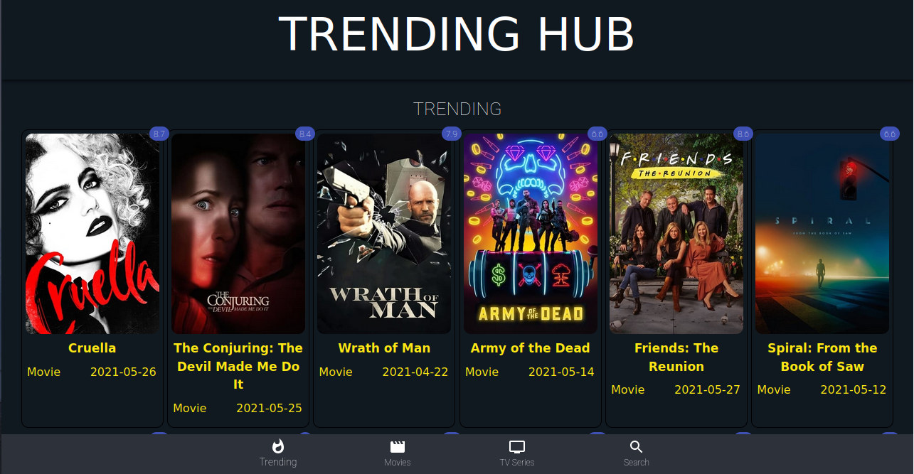
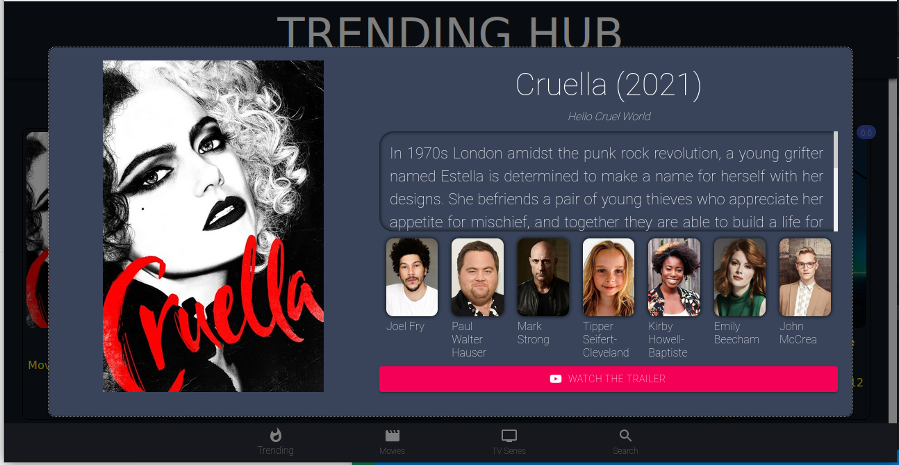

# Trending Hub

Trending Hub is Movie website application built with React, Users can see trending, TV Series, Movies and Search for movies, also they can filter the results.

 

## Screenshots of the app:

### Trending



### Focus



[Live Demo Link](https://arikarim.github.io/Trending-Hubb/)

## Built With

- React
- Material UI
- Css

## Prerequisities

To get this project up and running locally, you must follow the steps from the [getting started section](#getting-started).

## Getting Started

**To get this project set up on your local machine, follow these simple steps:**

**Step 1**<br>
Navigate through the local folder where you want to clone the repository and run: <br>

```
git clone https://github.com/arikarim/Trending-Hub
```

It will clone the repo to your local folder.

**Step 2**<br>

- Cd inside the project

- Run `npm run start`

## 🤝 contributing

contributions, issues, and feature requests are welcome!<br/>feel free to check [issues page](https://github.com/arikarim/Trending-Hub/issues).

## Author

- GitHub: [@arikarim](https://github.com/arikarim)
- LinkedIn: [AriKarim](https://www.linkedin.com/in/ari-karim-523bb81b3)

## 🙋‍♂ show your support

give a ⭐️ if you like this project!

## 📝 license

This project is [MIT](LICENSE) licensed.
